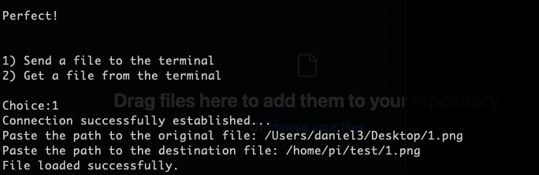
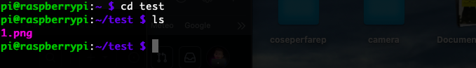

# Description

The SFTP Connector project is a Python file that provides an interface for SFTP (Secure File Transfer Protocol) connection between two terminals. The main goal of this project is to simplify the process of secure file transfer between terminals and to allow automation of this process.

Initially, the project was designed to be used on Raspberry Pi, however, it can be easily adapted and used on other devices or platforms.

## Features

Secure SFTP Connection: The SFTP Connector module allows a secure connection to be established between the current terminal and another remote terminal using the SFTP protocol.
File Transfer: Allows files to be uploaded and downloaded between the two terminals with the SFTP connection established.
## Installation

The SFTP Connector project requires the following dependencies:

**Python3:** The Python interpreter in version 3.x is required to run the SnakeSFTP file.

**pysftp:**  [PySFTP](https://github.com/dlitz/pysftpd) is a very useful Python library for automating file operations via SFTP, offering an intuitive interface to simplify managing remote files securely.

**colorama:** Colorama is a library for Python that makes it easy to print colored and stylized text in the terminal. Who wouldn't want colorful lettering in the terminal? :)


## Use 

After downloading and locating the file on your device, head into the terminal and run the command:

```bash
python3 (the path to the file you just downloaded)
```

Press enter and if everything has been done correctly, the program will run


After that you need to enter the IP address, nickname and password.

Now there are two choices, either to send files to our terminal or to fetch files from it. If we press 1 the following steps are:

1) Enter the path to the file we want to transfer, in this case mine is on the desktop, so it will be something like:

```
/User/[user]/Desktop/1.png``
```

Next we will have to go and enter the destination path, which will have the name of the file we are going to transfer as the last destination. In my case for example I am using a raspberry, and it will be something like:

```
/home/pi/test/1.png

!!! IMPORTANT: You need to write the exacte same name with the extension
```
By pressing enter if everything has been done correctly the file will be uploaded!



Now we go to verify that the file has actually been uploaded by going to access our Raspberry.



Here it is that in the test folder will be our image 1.png

The same procedure also applies if we need to take a file from a terminal and save it in our procedure
## Authors

- [@dani3lfrenc](https://www.github.com/dani3lfrenc)


## License

[Apache](https://choosealicense.com/licenses/apache/)

